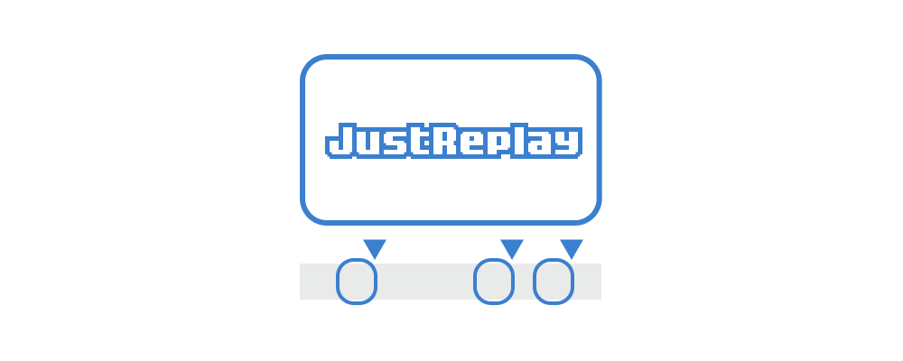

# JustReplay

OBS の Replay Buffer をいい感じにコントロールするツール  
A tool to control Replay Buffer in OBS Studio conveniently

---

> [!IMPORTANT]
> このツールは現在開発中です  
> This tool is currently under development

## Motivation

- I want to use OBS's Replay Buffer to play only the decisive moments (highlights) of a game match :punch:
- But with just the built-in features, I can only play all recorded or seek manually :cry:
- I want to put pins on the highlights and play back only those parts later :pleading_face:

## How To Use

1. Connect with OBS
1. Start recording replay buffer
1. Press the button at the highlight
1. Stop recording replay buffer
1. Replay only the highlights without editing :sparkles:

